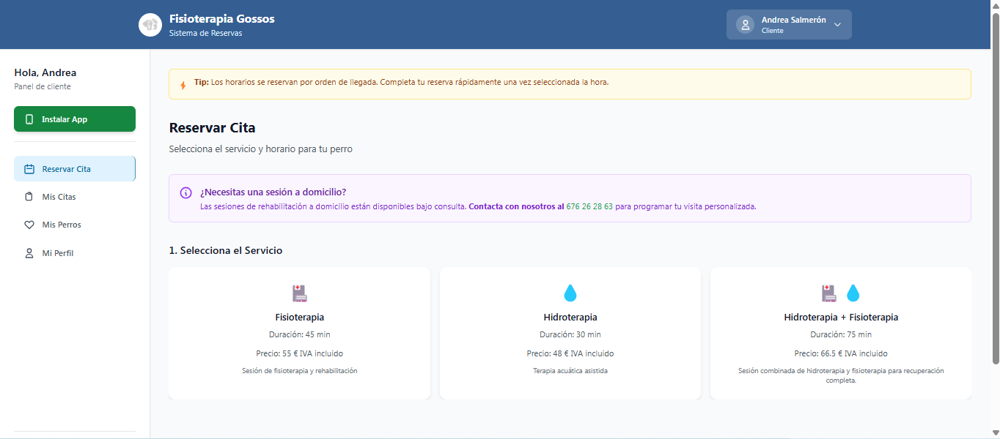
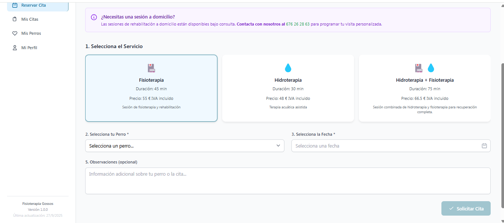
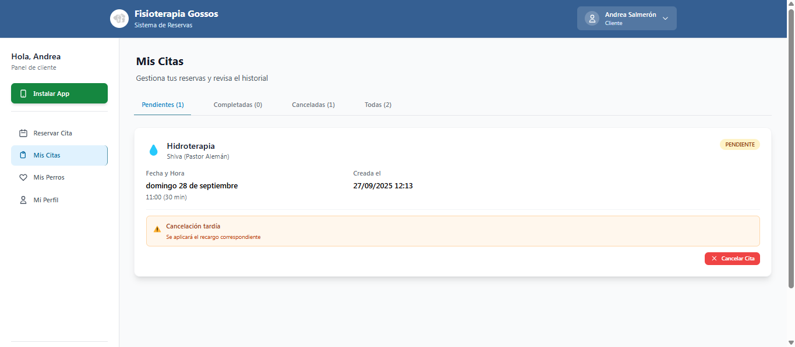
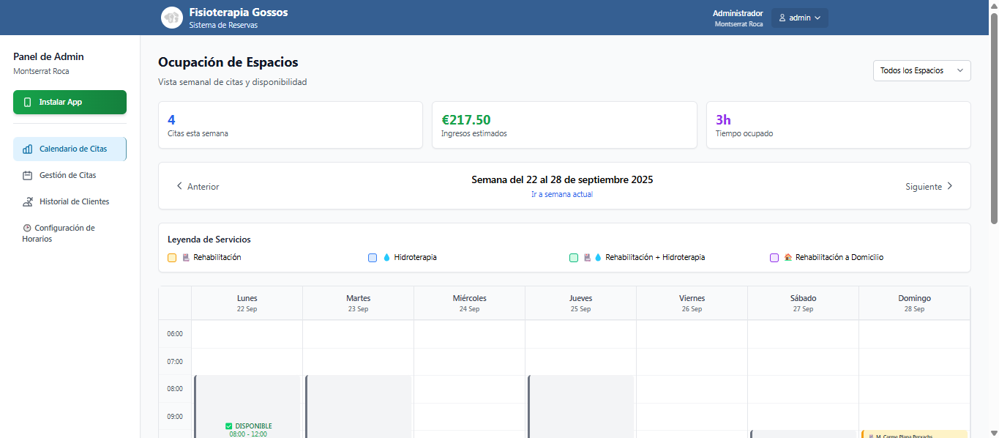
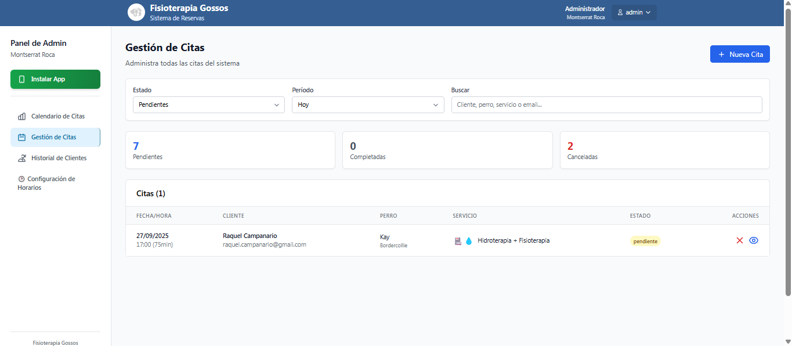
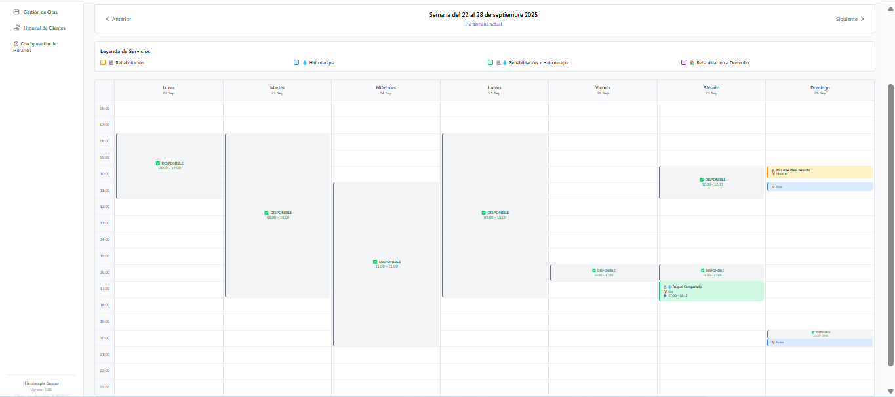
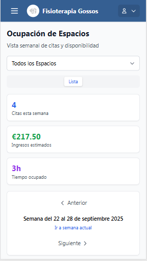
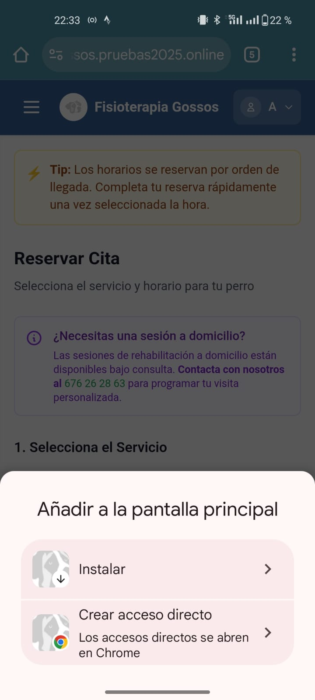
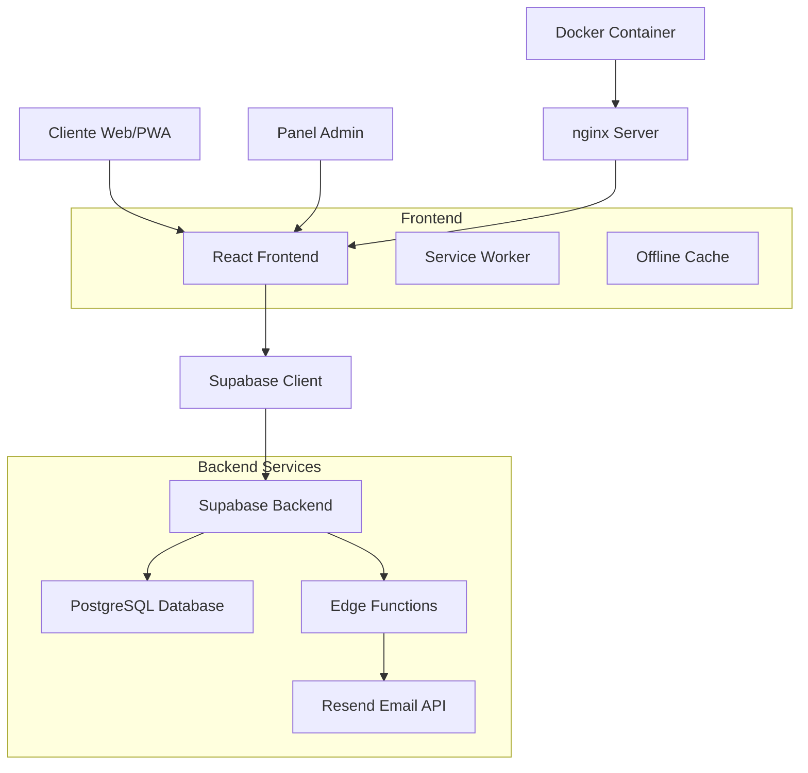

# 🐕 Fisioterapia Gossos - Sistema de Reservas PWA

## 📋 Descripción

**Fisioterapia Gossos** es una aplicación web progresiva (PWA) diseñada específicamente para centros de fisioterapia veterinaria canina. Ofrece un sistema completo de gestión de reservas con características avanzadas como compatibilidad de servicios, visitas a domicilio, y notificaciones automáticas.

### ✨ Características Principales

- **🎯 Sistema de Reservas Inteligente** - Motor avanzado de compatibilidad entre servicios
- **📱 PWA Instalable** - Funciona como aplicación nativa en móviles y escritorio
- **🏠 Visitas a Domicilio** - Gestión completa de rehabilitación en el hogar
- **👥 Gestión Dual** - Interfaz separada para clientes y administradores
- **📧 Notificaciones Automáticas** - Emails de confirmación y recordatorios
- **📊 Reportes de Ocupación** - Vista estilo Google Calendar para administradores
- **🎨 Diseño Responsive** - Optimizado para todos los dispositivos
- **⚡ Tiempo Real** - Actualizaciones instantáneas entre usuarios

## 🏥 Servicios Disponibles

| Servicio | Duración | Precio | Espacio |
|----------|----------|--------|---------|
| **Rehabilitación** | 30 min | €45 | Caseta de Rehabilitación |
| **Hidroterapia** | 30 min | €50 | Piscina |
| **Hidroterapia + Rehabilitación** | 60 min | €85 | Caseta + Piscina |
| **Aqua Agility** | 30 min | €40 | Piscina |
| **Rehabilitación a Domicilio** | Variable | €80/hora | Domicilio del Cliente |

### 🔒 Reglas de Compatibilidad

- **Hidroterapia individual**: Requiere exclusividad total del centro
- **Hidroterapia + Rehabilitación**: Requiere exclusividad total del centro  
- **Rehabilitación ↔ Aqua Agility**: Compatible en espacios separados
- **Visitas a Domicilio**: Bloquean automáticamente todo el centro

## 🛠️ Stack Tecnológico

### Frontend
- **React 18.2** - Biblioteca de interfaz de usuario
- **Vite 5.0** - Herramientas de desarrollo ultrarrápidas
- **Tailwind CSS** - Framework de estilos utilitarios
- **React Router 6** - Enrutamiento del lado del cliente
- **React Hot Toast** - Notificaciones elegantes

### Backend & Base de Datos
- **Supabase** - Backend como servicio
- **PostgreSQL** - Base de datos relacional
- **Row Level Security** - Seguridad a nivel de fila
- **Edge Functions** - Funciones serverless para emails

### PWA & Deployment
- **Vite PWA Plugin** - Configuración PWA optimizada
- **Workbox** - Service worker avanzado
- **Docker** - Containerización para producción
- **nginx** - Servidor web de alto rendimiento

## 📸 Capturas de Pantalla

### Panel de Cliente
<div align="center">

| Dashboard Principal | Reservar Cita | Mis Citas |
|:---:|:---:|:---:|
|  |  |  |

</div>

### Panel de Administrador
<div align="center">

| Dashboard Admin | Gestión de Citas | Calendario de Ocupación |
|:---:|:---:|:---:|
|  |  |  |

</div>

### Responsive & PWA
<div align="center">

| Vista Móvil | PWA Instalable |
|:---:|:---:|
|  |  |

</div>

## ⚡ Instalación Rápida

### Prerequisitos

- **Node.js** 18+ ([Descargar](https://nodejs.org/))
- **npm** o **yarn**
- **Cuenta Supabase** ([Crear gratis](https://supabase.com/))
- **Git** ([Descargar](https://git-scm.com/))

### 1. Clonar el Repositorio

```bash
git clone https://github.com/stitch-git/fisioterapia-gossos.git
cd fisioterapia-gossos
```

### 2. Instalar Dependencias

```bash
npm install
```

### 3. Configurar Variables de Entorno

```bash
# Copiar el archivo de ejemplo
cp .env.example .env

# Editar .env con tus credenciales de Supabase
nano .env
```

```env
# Configuración de Supabase
VITE_SUPABASE_URL=https://tu-proyecto.supabase.co
VITE_SUPABASE_ANON_KEY=tu_clave_anonima_aqui

# Configuración de la aplicación
VITE_APP_NAME="Fisioterapia Gossos"
VITE_APP_VERSION="1.0.0"
```

### 4. Configurar Base de Datos

```bash
# Configurar esquema en Supabase
# Ver docs/DATABASE.md para SQL completo
```

### 5. Ejecutar en Desarrollo

```bash
npm run dev
```

🎉 **¡Listo!** Abre [http://localhost:3000](http://localhost:3000) en tu navegador.

### 👤 Usuarios de Prueba

```
🔐 Administrador
Email: admin@fisioterapiagossos.com
Contraseña: admin123

👤 Cliente
Email: cliente@test.com  
Contraseña: cliente123
```

## 📖 Documentación

### 📚 Guías Principales

- **[Guía de Instalación Completa](docs/SETUP.md)** - Instalación paso a paso detallada
- **[Documentación de API](docs/API.md)** - Referencia completa de la API
- **[Esquema de Base de Datos](docs/DATABASE.md)** - Estructura y relaciones
- **[Guía de Deploy](docs/DEPLOYMENT.md)** - Deploy con Docker en producción
- **[Resolución de Problemas](docs/TROUBLESHOOTING.md)** - Soluciones a problemas comunes

### 🔧 Guías de Desarrollo

- **[Guía de Contribución](CONTRIBUTING.md)** - Cómo contribuir al proyecto
- **[Historial de Cambios](CHANGELOG.md)** - Registro de versiones y mejoras

## 🚀 Deploy en Producción

### Opción 1: Deploy con Docker (Recomendado)

```bash
# Construir imagen
docker build -t fisio-gossos:latest .

# Ejecutar contenedor
docker run -d \
  --name fisio-gossos \
  --restart unless-stopped \
  -p 8085:80 \
  fisio-gossos:latest
```

### Opción 2: Deploy con Script Automático

```bash
# Dar permisos y ejecutar
chmod +x deploy.sh
./deploy.sh
```

### Opción 3: Servicios Cloud

- **Vercel**: [](https://vercel.com/new/clone?repository-url=https://github.com/tu-usuario/fisioterapia-gossos)
- **Netlify**: [](https://app.netlify.com/start/deploy?repository=https://github.com/tu-usuario/fisioterapia-gossos)

Ver [docs/DEPLOYMENT.md](docs/DEPLOYMENT.md) para instrucciones detalladas.

## 🏗️ Arquitectura del Sistema



### 🔄 Flujo de Reservas

1. **Cliente** selecciona servicio y fecha
2. **Sistema** verifica disponibilidad en tiempo real
3. **Motor de compatibilidad** aplica reglas de negocio
4. **Función atómica** crea la reserva sin conflictos
5. **Notificaciones** se envían automáticamente
6. **Cache** se invalida para otros usuarios

## 📊 Características Técnicas Avanzadas

### ⚡ Rendimiento
- **Lazy Loading** de componentes y rutas
- **Code Splitting** automático con Vite
- **Service Worker** con cache inteligente
- **Optimización de imágenes** automática
- **Consultas optimizadas** con índices de BD

### 🔒 Seguridad
- **Row Level Security** en Supabase
- **Validación** en cliente y servidor
- **Sanitización** de datos de entrada
- **Headers de seguridad** en nginx
- **HTTPS** obligatorio en producción

### 📱 PWA Features
- **Instalación** en dispositivos
- **Funcionamiento offline** básico
- **Iconos adaptativos** para todas las plataformas
- **Shortcuts** de aplicación
- **Theme color** personalizado

## 🤝 Contribuir

¡Las contribuciones son bienvenidas! Lee nuestra [Guía de Contribución](CONTRIBUTING.md) para empezar.

### 🐛 Reportar Bugs

1. Busca en [Issues existentes](https://github.com/tu-usuario/fisioterapia-gossos/issues)
2. Crea un [Nuevo Issue](https://github.com/tu-usuario/fisioterapia-gossos/issues/new) con detalles
3. Usa los templates proporcionados

### ✨ Solicitar Funcionalidades

1. Revisa el [roadmap del proyecto](#-roadmap)
2. Crea un [Feature Request](https://github.com/tu-usuario/fisioterapia-gossos/issues/new?template=feature_request.md)
3. Describe el caso de uso y beneficios

### 🔧 Desarrollo Local

```bash
# Fork del repositorio
git clone https://github.com/tu-usuario/fisioterapia-gossos.git

# Crear rama de feature
git checkout -b feature/mi-nueva-funcionalidad

# Hacer cambios y commit
git commit -m "feat: agregar nueva funcionalidad"

# Push y crear Pull Request
git push origin feature/mi-nueva-funcionalidad
```

## 🗺️ Roadmap

### 📅 Próximas Versiones

#### v1.1.0 - Mejoras de UX
- [ ] Notificaciones push web
- [ ] Recordatorios automáticos por email
- [ ] Exportar calendario a Google Calendar
- [ ] Temas claro/oscuro

#### v1.2.0 - Funcionalidades Avanzadas  
- [ ] Sistema de pagos integrado
- [ ] Historial médico de mascotas
- [ ] Integración con WhatsApp Business
- [ ] API pública para terceros

#### v1.3.0 - Analytics y Reportes
- [ ] Dashboard de métricas avanzadas
- [ ] Reportes de ingresos detallados
- [ ] Análisis de ocupación por servicio
- [ ] Exportación de datos a Excel

### 🎯 Ideas Futuras
- Integración con sistemas veterinarios
- App móvil nativa (React Native)
- Sistema de fidelización de clientes
- Reservas recurrentes automáticas

## 🏆 Reconocimientos

### 🛠️ Tecnologías Utilizadas

- [React](https://reactjs.org/) - La biblioteca de UI que hace posible todo
- [Supabase](https://supabase.com/) - Backend increíblemente potente y fácil
- [Tailwind CSS](https://tailwindcss.com/) - Estilos hermosos sin esfuerzo
- [Vite](https://vitejs.dev/) - Herramientas de desarrollo súper rápidas
- [React Router](https://reactrouter.com/) - Navegación fluida SPA

### 🎨 Recursos de Diseño

- [Heroicons](https://heroicons.com/) - Iconos elegantes y consistentes
- [Headless UI](https://headlessui.dev/) - Componentes accesibles
- [React Hot Toast](https://react-hot-toast.com/) - Notificaciones deliciosas

## 📄 Licencia

Este proyecto está bajo la Licencia MIT. Ver [LICENSE](LICENSE) para más detalles.

```
MIT License

Copyright (c) 2025 Fisioterapia Gossos

Permission is hereby granted, free of charge, to any person obtaining a copy
of this software and associated documentation files (the "Software"), to deal
in the Software without restriction, including without limitation the rights
to use, copy, modify, merge, publish, distribute, sublicense, and/or sell
copies of the Software, and to permit persons to whom the Software is
furnished to do so, subject to the following conditions:

The above copyright notice and this permission notice shall be included in all
copies or substantial portions of the Software.

THE SOFTWARE IS PROVIDED "AS IS", WITHOUT WARRANTY OF ANY KIND, EXPRESS OR
IMPLIED, INCLUDING BUT NOT LIMITED TO THE WARRANTIES OF MERCHANTABILITY,
FITNESS FOR A PARTICULAR PURPOSE AND NONINFRINGEMENT. IN NO EVENT SHALL THE
AUTHORS OR COPYRIGHT HOLDERS BE LIABLE FOR ANY CLAIM, DAMAGES OR OTHER
LIABILITY, WHETHER IN AN ACTION OF CONTRACT, TORT OR OTHERWISE, ARISING FROM,
OUT OF OR IN CONNECTION WITH THE SOFTWARE OR THE USE OR OTHER DEALINGS IN THE
SOFTWARE.
```

## 📞 Contacto y Soporte

### 🏢 Información de la Empresa

**Fisioterapia Gossos**  
📍 Llinars del Vallès, Cataluña, España  
📞 [676 26 28 63](https://wa.me/34676262863)  
📧 info@fisioterapiagossos.com  
🌐 [www.fisioterapiagossos.com](https://fisioterapiagossos.com)

### 💻 Soporte Técnico

- **Issues de GitHub**: [Reportar problema](https://github.com/tu-usuario/fisioterapia-gossos/issues)
- **Documentación**: [docs/TROUBLESHOOTING.md](docs/TROUBLESHOOTING.md)
- **Email técnico**: andreasb2511@gmail.com

### 🌟 Síguenos

- **GitHub**: 
- **LinkedIn**: 
---

<div align="center">

**Hecho con ❤️ para la salud y bienestar de nuestros compañeros de cuatro patas**

[⬆ Volver arriba](#-fisioterapia-gossos---sistema-de-reservas-pwa)

</div>